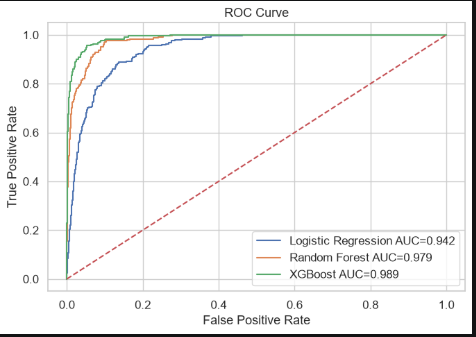
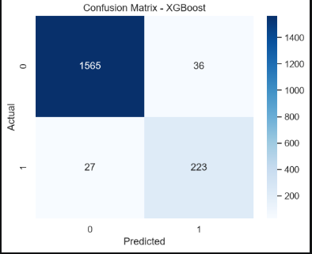
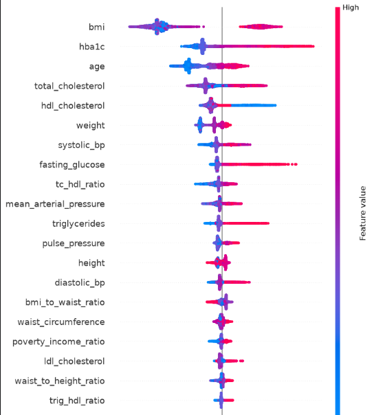
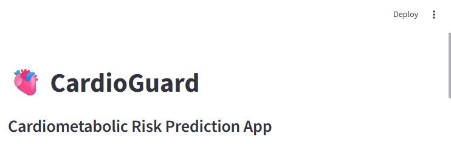
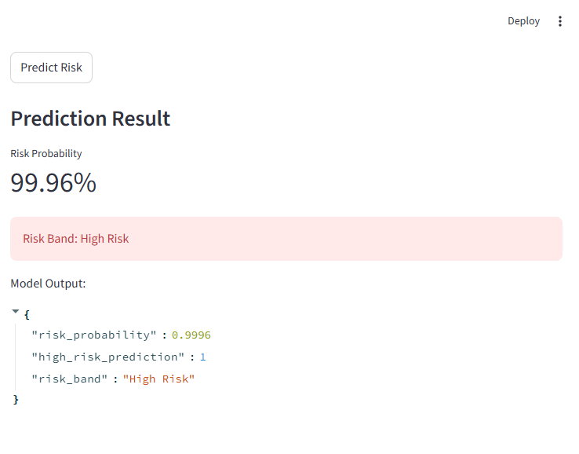
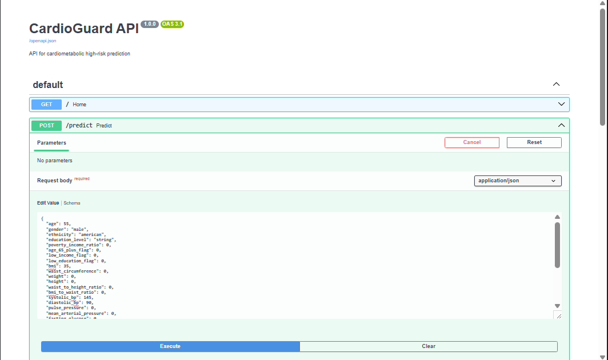
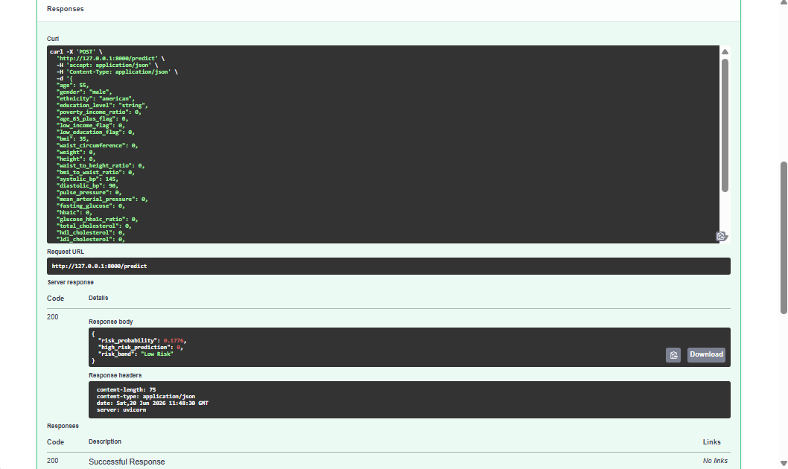

# 🚀 CardioGuard: Cardiometabolic Risk Stratification Engine

**Python • Scikit-Learn • XGBoost • FastAPI • Streamlit • SHAP**

**Advanced Healthcare Analytics & Cardiometabolic Risk Prediction Using NHANES Data**

---

# 📋 Table of Contents

* Overview
* Project Scope
* Business Context
* Key Features
* System Architecture
* Project Structure
* Technology Stack
* Quick Start
* Data Pipeline
* Feature Engineering
* Model Development
* Model Performance
* Explainability
* Streamlit Dashboard
* FastAPI Deployment
* API Documentation
* Evaluation Metrics
* Roadmap
* Author

---

# 🎯 Overview

CardioGuard is an end-to-end healthcare machine learning system designed to identify individuals at elevated cardiometabolic risk using demographic, anthropometric, laboratory, blood pressure, and lifestyle factors derived from NHANES data.

The project demonstrates production-grade healthcare data science practices including:

✅ Exploratory Data Analysis


✅ Feature Engineering

✅ Risk Stratification

✅ Machine Learning Modeling

✅ Explainable AI (SHAP)

✅ FastAPI Deployment

✅ Streamlit Dashboard

✅ End-to-End Healthcare Analytics Pipeline

---

# 📊 Project Scope

| Metric       | Value                                       |
| ------------ | ------------------------------------------- |
| Industry     | Healthcare Analytics                        |
| Dataset      | NHANES 2017–2018                            |
| Population   | US Adults                                   |
| Records      | ~1,850 Participants                         |
| Features     | 30+ Engineered Variables                    |
| Models       | Logistic Regression, Random Forest, XGBoost |
| Best Model   | XGBoost                                     |
| Best ROC-AUC | 0.9036                                      |
| Deployment   | FastAPI + Streamlit                         |

---

# 🏥 Business Context

## The Challenge

Cardiometabolic diseases remain among the leading causes of morbidity and mortality worldwide.

Healthcare systems face significant challenges:

📈 Rising prevalence of diabetes

📈 Increasing obesity rates

📈 Undiagnosed hypertension

📈 Delayed risk identification

📈 Escalating healthcare costs

Traditional screening approaches often identify high-risk individuals only after disease progression has occurred.

---

## The Solution

CardioGuard provides a data-driven healthcare intelligence platform capable of:

* Early identification of high-risk individuals
* Automated risk stratification
* Explainable machine learning predictions
* Real-time risk scoring
* Population health analytics

---

## Business Impact

🎯 Earlier identification of high-risk individuals

💰 Potential reduction in long-term healthcare costs

📈 Improved preventive healthcare interventions

⚡ Real-time risk assessment through deployed APIs

🏥 Supports population health management strategies

---

# ✨ Key Features

## 🎯 Cardiometabolic Risk Prediction

Models evaluated:

* Logistic Regression
* Random Forest
* XGBoost

Best Model:

🏆 XGBoost Classifier

ROC-AUC = 0.9036

---

## 📊 Risk Stratification

Patients were segmented into:

* Low Risk
* Moderate Risk
* High Risk

using K-Means clustering to support population-level health management.

---

## 🧠 Explainable AI

SHAP was used to explain model predictions and identify major risk drivers.

Top predictors included:

* HbA1c
* Fasting Glucose
* BMI
* Waist Circumference
* Blood Pressure
* Cholesterol Indicators

---

## 🚀 Production API

FastAPI deployment providing:

* Real-time scoring
* Swagger documentation
* JSON responses
* Production-ready architecture

---

## 📊 Interactive Dashboard

Streamlit dashboard enabling:

* Patient-level risk prediction
* Risk probability scoring
* Risk band classification
* Clinical interpretation

---

# 🏗️ System Architecture

```text
NHANES Data
      │
      ▼
Preprocessing
      │
      ▼
Feature Engineering
      │
      ▼
Risk Segmentation
      │
      ▼
Machine Learning Modeling
      │
      ▼
SHAP Explainability
      │
      ▼
FastAPI Deployment
      │
      ▼
Streamlit Dashboard
```

---

# 📁 Project Structure

```text
CardioGuard_Project/
│
├── data/
│   ├── raw/
│   └── processed/
│
├── notebooks/
│   ├── 01_eda.ipynb
│   ├── 02_preprocessing.ipynb
│   ├── 03_feature_engineering.ipynb
│   ├── 04_segmentation.ipynb
│   ├── 05_modeling.ipynb
│   ├── 06_explainability.ipynb
│   └── 07_dashboard_export.ipynb
│
├── reports/
│   ├── roc_curve.png
│   ├── confusion_matrix.png
│   ├── shap_summary.png
│   ├── streamlit_app.png
│   └── fastapi_docs.png
│
├── models/
│   ├── cardioguard_best_model.pkl
│   ├── cardioguard_feature_cols.pkl
│   ├── cardioguard_best_threshold.pkl
│   ├── cardioguard_kmeans_segmentation.pkl
│   ├── cardioguard_scaler_segmentation.pkl
│   └── cardioguard_segmentation_feature_cols.pkl
│
├── src/
│   ├── preprocessing.py
│   ├── feature_engineering.py
│   ├── train_model.py
│   ├── predict.py
│   └── api/
│       └── main.py
│
├── streamlit_app.py
├── requirements.txt
├── .gitignore
└── README.md
```

---

# 🛠️ Technology Stack

| Category         | Technologies          |
| ---------------- | --------------------- |
| Machine Learning | Scikit-Learn, XGBoost |
| Data Processing  | Pandas, NumPy         |
| Visualization    | Matplotlib, Seaborn   |
| Explainability   | SHAP                  |
| API Framework    | FastAPI               |
| Dashboard        | Streamlit             |
| Deployment       | Uvicorn               |
| Version Control  | Git, GitHub           |

---

# 🚀 Quick Start

## Clone Repository

```bash
git clone https://github.com/Alpha-rammy/CardioGuard_Risk_Prediction.git
cd CardioGuard_Risk_Prediction
```

## Create Virtual Environment

```bash
python -m venv venv
```

## Activate Environment

```bash
venv\Scripts\activate
```

## Install Dependencies

```bash
pip install -r requirements.txt
```

## Train Model

```bash
python src/train_model.py
```

---

# 📊 Data Pipeline

Data Sources:

* Demographics
* Body Measures
* Blood Pressure
* Glucose
* HbA1c
* Cholesterol
* Smoking Questionnaire
* Physical Activity Questionnaire

---

# 🔧 Feature Engineering

Features engineered include:

### Anthropometric Features

* BMI
* Waist Circumference
* Waist-to-Height Ratio

### Blood Pressure Features

* Systolic Blood Pressure
* Diastolic Blood Pressure
* Pulse Pressure
* Mean Arterial Pressure

### Metabolic Features

* Fasting Glucose
* HbA1c
* Total Cholesterol
* HDL Cholesterol
* LDL Cholesterol

### Lifestyle Features

* Smoking Status
* Physical Activity

### Clinical Indicators

* Obesity Flag
* Diabetes Flag
* Hypertension Flag
* Hyperlipidemia Flag

---

# 🤖 Model Development

## Models Evaluated

| Model               | ROC-AUC |
| ------------------- | ------- |
| Logistic Regression | 0.8827  |
| Random Forest       | 0.8895  |
| XGBoost             | 0.9036  |

---

# 🏆 Model Performance

Best Model:

**XGBoost**

ROC-AUC = **0.9036**

---

# 📈 ROC Curve



---

# 📈 Confusion Matrix



---

# 🧠 Explainability

SHAP was used to understand how each feature contributes to model predictions.



---

# 📊 Streamlit Dashboard

The Streamlit application provides an interactive interface for healthcare professionals and analysts to perform real-time cardiometabolic risk assessments.

### Dashboard Features

* Patient-level risk prediction
* Risk probability scoring
* Risk band classification
* Clinical interpretation
* User-friendly interface

### Run Dashboard

```bash
streamlit run streamlit_app.py
```

### Access Dashboard

```text
http://localhost:8501
```

### Dashboard Preview





---

# 🚀 FastAPI Deployment

The trained XGBoost model is exposed through a FastAPI REST API.

### API Features

* Real-time prediction
* JSON responses
* Swagger documentation
* Production-ready deployment

### Run FastAPI

```bash
uvicorn src.api.main:app --reload
```

### Access Swagger Documentation

```text
http://127.0.0.1:8000/docs
```

### FastAPI Preview




---

# 📡 API Documentation

### Example Response

```json
{
  "risk_probability": 0.87,
  "high_risk_prediction": 1,
  "risk_band": "High Risk"
}
```

---

# 📈 Evaluation Metrics

Model evaluation included:

* ROC-AUC
* Precision
* Recall
* F1 Score
* Confusion Matrix
* SHAP Explainability

---

# 🔮 Roadmap

## Phase 1

✅ Data Cleaning

✅ Feature Engineering

✅ Risk Stratification

✅ Machine Learning Modeling

---

## Phase 2

✅ SHAP Explainability

✅ FastAPI Deployment

✅ Streamlit Dashboard

---

## Phase 3

⬜ Docker Deployment

⬜ Cloud Hosting

⬜ Real-Time Monitoring

⬜ Population Health Dashboard

⬜ NHS Integration Simulation

---

# 👨‍⚕️ Author

**Ransom Chukwu**


GitHub: https://github.com/Alpha-rammy

---

## License

This project is intended for educational, research, and portfolio purposes.
